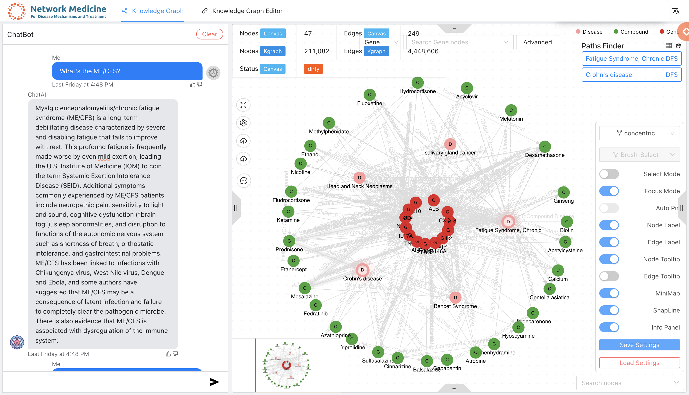
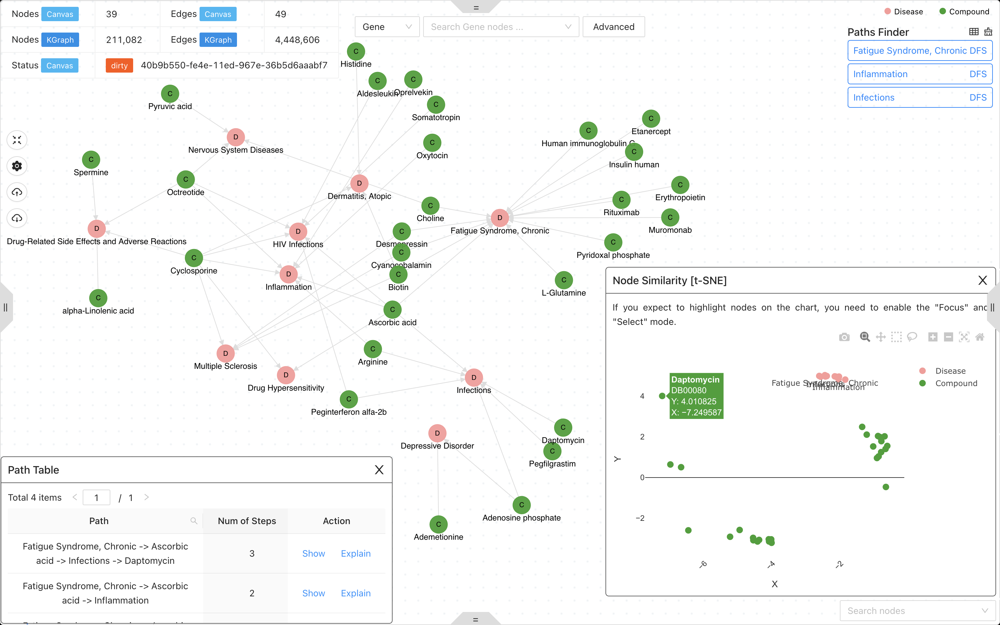
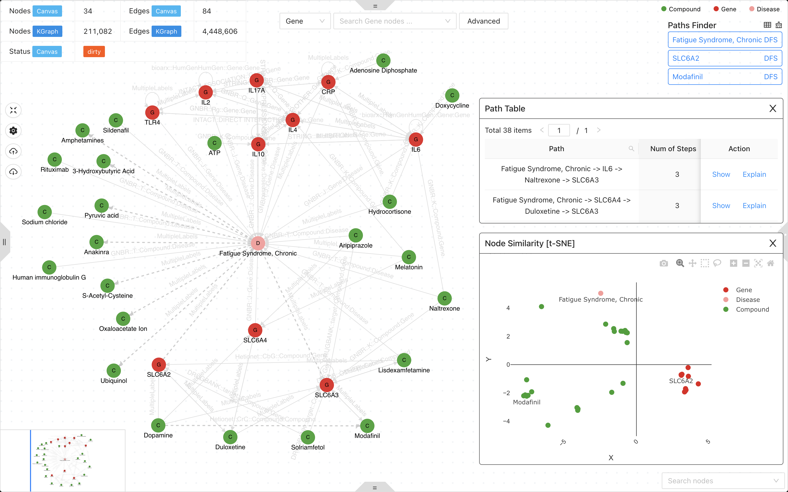

# BioMedGPS Studio

A knowledge graph system with graph neural network for drug discovery, disease mechanism, biomarker screening and discovering response to toxicant exposure.

## Features

- [x] Knowledge graph studio for graph query, visualization and analysis.
- [x] Graph neural network for drug discovery, disease mechanism, biomarker screening and discovering response to toxicant exposure.
- [x] Support customized knowledge graph schema and data source.
- [x] Support customized graph neural network model.
- [x] Support customized omics datasets.
- [x] Integrated large language models (such as vicuna, rwkv, chatgpt etc. more details on [chat-publications](https://github.com/yjcyxky/chat-publications)) for answering questions.

## Demo

### Ask questions with chatbot



### Find similar diseases with your queried disease



### Predict drugs and related genes for your queried disease



### Find potential paths between two nodes


## Launch frontend

Clone the repo and install dependencies.

```bash
git clone https://github.com/yjcyxky/biomedgps-studio.git

# Recommend using yarn and node v16.13.1

cd biomedgps-studio && yarn
```

Start the frontend server.

```bash
# Use the remote backend
yarn start:remote-dev

# If you have launched the backend server locally, please use the following command.
# You can find the backend server code on [biomedgps](https://github.com/yjcyxky/biomedgps) or [rapex](https://github.com/yjcyxky/rapex)
yarn start:local-dev

# Release it to GitHub
yarn build && yarn gh-pages
```

## License

Copyright © 2022 Jingcheng Yang

This program and the accompanying materials are made available under the terms of the Eclipse Public License 2.0 which is available at http://www.eclipse.org/legal/epl-2.0.

This Source Code may also be made available under the following Secondary Licenses when the conditions for such availability set forth in the Eclipse Public License, v. 2.0 are satisfied: GNU General Public License as published by the Free Software Foundation, either version 2 of the License, or (at your option) any later version, with the GNU Classpath Exception which is available at https://www.gnu.org/software/classpath/license.html.
